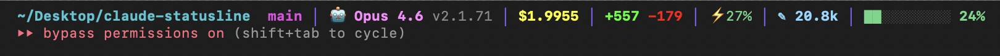

# Claude Code Custom Statusline

> :art: Une statusline personnalisée et colorée pour [Claude Code](https://docs.anthropic.com/en/docs/claude-code), le CLI officiel d'Anthropic.

---

## :eyes: Aperçu

Coût dynamique, ratio API avec icônes adaptatives, tokens output, alertes contexte — tout ce qu'il faut pour garder le contrôle de sa session.



---

## :rocket: Installation

```bash
curl -fsSL https://raw.githubusercontent.com/anthonymarandon/claude-statusline/main/install.sh | bash
```

> Le script télécharge le fichier dans `~/.claude/`, configure `settings.json`, et vous demande confirmation si des fichiers existants seront modifiés.

---

## :speech_balloon: Commande `/session-info`

L'installation inclut automatiquement la commande `/session-info`. Tapez-la dans Claude Code pour obtenir un **résumé en langage naturel** de votre session :

- Quel modèle vous utilisez
- Combien la session a coûté
- L'utilisation de la fenêtre de contexte
- Les lignes modifiées, tokens générés, ratio API
- Des alertes si le contexte ou le coût deviennent critiques

> Claude lit les données de sa propre statusline et vous les explique.

---

## :bar_chart: Fonctionnalités

| Fonctionnalité | Détail |
|---|---|
| :file_folder: Chemin | Répertoire courant avec `~` en cyan |
| :deciduous_tree: Branche git | Branche active en magenta |
| :robot: Modèle | Nom du modèle Claude (ex: Opus 4.6) en rose |
| :label: Version | Numéro de version de Claude Code en gris |
| :dollar: Coût dynamique | Couleur adaptative selon le montant |
| :heavy_plus_sign: :heavy_minus_sign: Lignes | Lignes ajoutées (vert) / supprimées (rouge) |
| :zap: Ratio API | Icône et couleur selon l'intensité (voir ci-dessous) |
| :pencil2: Tokens output | Tokens générés par Claude dans la session |
| :bar_chart: Barre contexte | Barre `█░` colorée selon le remplissage |
| :rotating_light: Alerte > 75% | Fond rouge quand le contexte se remplit |
| :warning: Alerte > 200k | Avertissement clignotant si la fenêtre explose |

### :dollar: Coût dynamique

La couleur du coût change selon le montant pour vous alerter visuellement :

| Couleur | Seuil | Signification |
|---|---|---|
| :green_circle: Vert | < 1$ | Tout va bien |
| :yellow_circle: Jaune | 1$ – 5$ | Ça commence à chiffrer |
| :red_circle: Rouge | > 5$ | Session coûteuse, pensez à en ouvrir une nouvelle |

### :zap: Ratio API

Le pourcentage du temps passé à **attendre les réponses de Claude** par rapport au temps total de la session. L'icône change selon l'intensité :

| Icône | Couleur | Seuil | Signification |
|---|---|---|---|
| :seedling: | :green_circle: Vert | ≤ 40% | Session économe |
| :zap: | :yellow_circle: Jaune | 40–70% | Échange actif |
| :fire: | :orange_circle: Orange | > 70% | Claude travaille en continu |

---

## :package: Prérequis

- [Claude Code](https://docs.anthropic.com/en/docs/claude-code) installé
- [`jq`](https://jqlang.github.io/jq/) — outil de parsing JSON en ligne de commande

> :bulb: `jq` est souvent préinstallé sur macOS. Le script d'installation le vérifie automatiquement.

| OS | Installer jq |
|---|---|
| :apple: macOS | `brew install jq` |
| :penguin: Ubuntu / Debian | `sudo apt install jq` |
| :penguin: Arch | `sudo pacman -S jq` |
| :penguin: Fedora | `sudo dnf install jq` |
| :computer: Windows | `winget install jqlang.jq` ou `choco install jq` |

---

## :art: Personnalisation

Modifiez les variables de couleur en haut du script :

```bash
C_PATH="\033[1;36m"        # Chemin — cyan
C_GIT="\033[1;35m"         # Branche git — magenta
C_MODEL="\033[1;38;5;213m" # Modèle — rose
C_ADD="\033[1;38;5;46m"    # Lignes ajoutées — vert
C_DEL="\033[1;38;5;196m"   # Lignes supprimées — rouge
```

---

## :bug: Debug

Le JSON reçu de Claude Code est sauvegardé automatiquement :

```bash
cat /tmp/claude-statusline-input.json
```

<details>
<summary>:mag: Voir tous les champs JSON disponibles</summary>

| Champ | Description |
|---|---|
| `session_id` | Identifiant de la session |
| `version` | Version de Claude Code |
| `model.id` / `model.display_name` | Modèle utilisé |
| `workspace.current_dir` | Répertoire courant |
| `cost.total_cost_usd` | Coût en USD |
| `cost.total_duration_ms` | Durée totale (ms) |
| `cost.total_api_duration_ms` | Durée API (ms) |
| `cost.total_lines_added` / `removed` | Lignes modifiées |
| `context_window.used_percentage` | % contexte utilisé |
| `context_window.total_output_tokens` | Tokens générés |
| `exceeds_200k_tokens` | Dépasse 200k ? |

</details>

---

## :warning: Note locale macOS / Europe

Si votre système utilise la virgule comme séparateur décimal, le formatage des prix peut casser. Le script gère ce cas avec `LANG=C awk`. Gardez cette syntaxe si vous modifiez le script :

```bash
echo "$cost_usd" | LANG=C awk '{printf "%.4f", $1}'
```

---

## :scroll: Licence

MIT — Voir [LICENSE](LICENSE).
