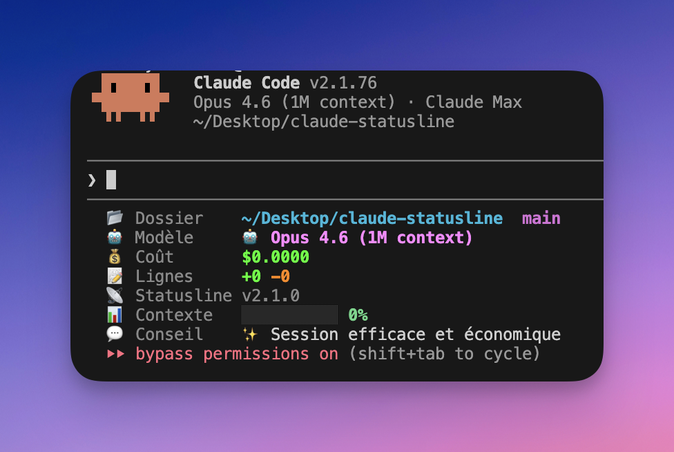

# Claude Code Custom Statusline

[](https://github.com/anthonymarandon/claude-statusline/releases)
[](LICENSE)
[](statusline-command.sh)
[](https://github.com/anthonymarandon/claude-statusline)
[](https://github.com/anthonymarandon/claude-statusline)
[](https://github.com/anthonymarandon/claude-statusline)

> Une statusline personnalisée et colorée pour [Claude Code](https://docs.anthropic.com/en/docs/claude-code), le CLI officiel d'Anthropic.



## Installation

```bash
curl -fsSL https://raw.githubusercontent.com/anthonymarandon/claude-statusline/main/install.sh | bash
```

### Prérequis

- [Claude Code](https://docs.anthropic.com/en/docs/claude-code) — `claude --version`
- [`jq`](https://jqlang.org/) — `jq --version`

> Selon votre système d'exploitation, vérifiez que vous disposez de ces outils avec les commandes ci-dessus.

---

## Indicateurs

| Indicateur | Description |
|---|---|
| 📁 Dossier | Répertoire courant + branche git (● si dirty) |
| 🤖 Modèle | Modèle Claude utilisé |
| 💰 Coût | Couleur adaptative : 🟢 < 1$ · 🟡 1–5$ · 🔴 > 5$ |
| ✏️ Lignes | Ajoutées / supprimées |
| ⚡ API | Temps d'attente API : 🌱 ≤ 40% · ⚡ 40–70% · 🔥 > 70% + durée session |
| 🔮 Tokens | Tokens output générés par Claude |
| 📡 Statusline | Version + indicateur de mise à jour disponible |
| 📊 Contexte | Barre de remplissage + alerte à 75% et 200k tokens |
| 💬 Conseil | Message dynamique selon l'état de la session |

---

## Commandes

| Commande | Action |
|---|---|
| `/statusline-help` | Explication visuelle de chaque indicateur |
| `/statusline-update` | Mise à jour sans quitter la session |
| `/statusline-uninstall` | Désinstallation complète |

La statusline vérifie automatiquement les mises à jour toutes les 2 minutes. Un indicateur `⬆ vX.Y.Z` apparaît quand une nouvelle version est disponible.

---

## Avertissement — Pratiques non autorisées

> **Les contributeurs doivent impérativement lire cette section avant de soumettre une PR.**

Ce projet n'intègre **aucun appel réseau vers des API non documentées** d'Anthropic.
Les fonctionnalités reposent uniquement sur les données JSON fournies nativement par Claude Code au script statusline.

Les pratiques suivantes sont **interdites** dans ce projet car elles violent les [Conditions Générales d'Utilisation](https://www.anthropic.com/legal/consumer-terms) d'Anthropic :

- Utiliser des **tokens OAuth** d'abonnement (Pro/Max) en dehors de Claude Code ou Claude.ai
- Appeler des **endpoints API non documentés** (découverts par reverse-engineering)
- **Usurper le User-Agent** de Claude Code (`claude-code/X.X.X`)
- Accéder aux services Anthropic via des **scripts ou bots non autorisés**

Pour consulter les quotas d'abonnement, utilisez la commande `/usage` directement dans Claude Code.

Voir la documentation détaillée : [`maquette/usage-notice-warning/usage-quota-non-inclus.md`](maquette/usage-notice-warning/usage-quota-non-inclus.md)

---

## Personnalisation

Modifiez les variables de couleur en haut de `~/.claude/statusline-command.sh` :

```bash
C_PATH="\033[1;36m"        # Chemin — cyan
C_GIT="\033[1;35m"         # Branche git — magenta
C_MODEL="\033[1;38;5;213m" # Modèle — rose
C_ADD="\033[1;38;5;46m"    # Lignes ajoutées — vert
C_DEL="\033[1;38;5;208m"   # Lignes supprimées — orange
```

---

## Debug

```bash
cat ~/.claude/.statusline-debug.json
```

<details>
<summary>Champs JSON disponibles</summary>

| Champ | Description |
|---|---|
| `model.id` / `model.display_name` | Modèle utilisé |
| `workspace.current_dir` | Répertoire courant |
| `cost.total_cost_usd` | Coût en USD |
| `cost.total_duration_ms` | Durée totale |
| `cost.total_api_duration_ms` | Durée API |
| `cost.total_lines_added` / `removed` | Lignes modifiées |
| `context_window.used_percentage` | % contexte utilisé |
| `context_window.total_output_tokens` | Tokens générés |

</details>

---

## Troubleshooting

<details>
<summary>La statusline ne s'affiche pas</summary>

1. Vérifiez la clé `statusLine` dans `~/.claude/settings.json` : `cat ~/.claude/settings.json | jq '.statusLine'`
2. Vérifiez que le script existe : `ls -la ~/.claude/statusline-command.sh`
3. Relancez Claude Code.

</details>

<details>
<summary>Erreur de parsing JSON</summary>

1. Vérifiez que `jq` est installé : `jq --version`
2. Inspectez : `cat ~/.claude/.statusline-debug.json`

</details>

<details>
<summary>Couleurs absentes</summary>

- Vérifiez le support : `tput colors` (doit afficher `256`+)
- `NO_COLOR=1` ou `TERM=dumb` désactive les couleurs.

</details>

<details>
<summary>⚠️ Note importante — Statusline bloquée en mode bypass permission (v2.1.74+)</summary>

Si vous lancez Claude Code avec un mode d'autorisation spécifique (comme `--dangerously-skip-permissions`), la statusline peut ne pas s'afficher. Ces modes sautent le dialogue de workspace trust au démarrage, mais ne valident jamais le trust nécessaire à l'exécution de la statusline.

**Solution :**

1. Lancez d'abord `claude` normalement (sans mode d'autorisation) dans votre répertoire de travail
2. Acceptez le dialogue de workspace trust
3. Vous pouvez ensuite relancer Claude avec le mode de votre choix (bypass, etc.)

Le trust étant désormais enregistré pour ce répertoire, la statusline fonctionnera normalement. Cette opération est à refaire pour chaque nouveau répertoire de travail.

</details>

---

## Licence

MIT — Voir [LICENSE](LICENSE).
